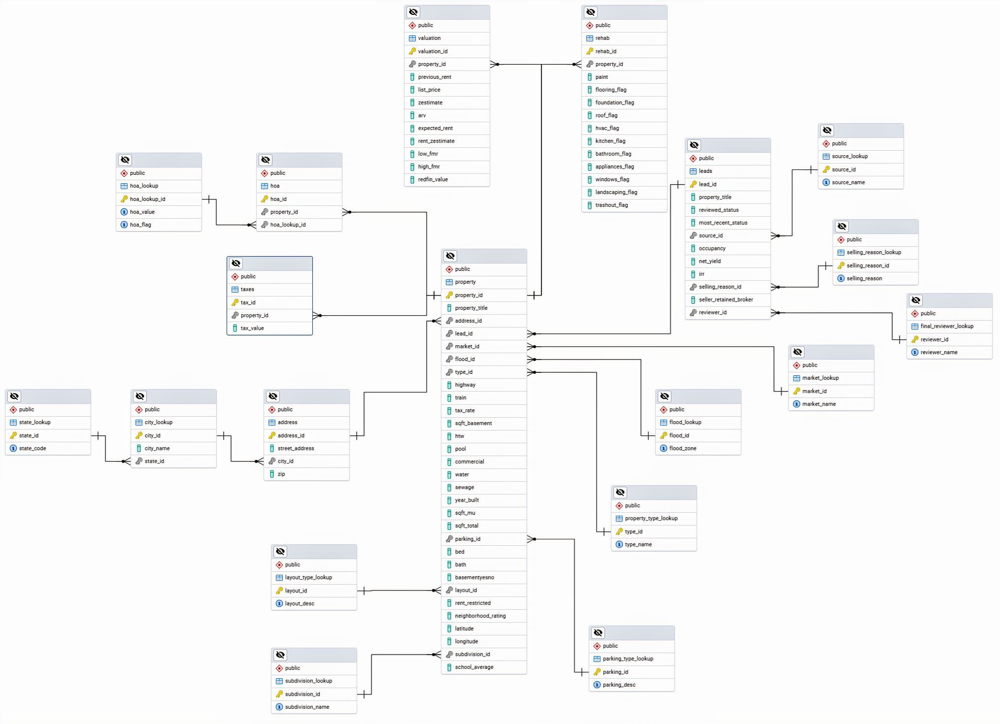

# 🏠 Property Data Engineering Pipeline

[](https://python.org)
[](https://mysql.com)
[](https://pandas.pydata.org)
[](LICENSE)

> **A comprehensive ETL pipeline demonstrating advanced data engineering practices for property management systems**

This repository showcases a complete **Extract, Transform, Load (ETL)** solution that processes raw property data and transforms it into a normalized, production-ready database schema. Built with Python and MySQL, this project demonstrates enterprise-level data engineering skills including database normalization, data validation, and scalable ETL architecture.

## 🎯 Project Highlights

- **Database Normalization**: Designed and implemented a fully normalized schema (3NF) with 16+ tables
- **ETL Pipeline**: Built a robust Python-based ETL system handling 10,000+ property records
- **Data Quality**: Comprehensive data cleaning and validation with detailed logging
- **Scalable Architecture**: Modular design supporting easy maintenance and extension
- **Production Ready**: Enterprise-grade error handling and transaction management

## 📊 Database Architecture

<div align="center">
  
  <p><em>Normalized database schema with proper relationships and constraints</em></p>
</div>

### Key Design Features:
- **3NF Normalized Schema**: Eliminates data redundancy and ensures consistency
- **16 Interconnected Tables**: Proper foreign key relationships and referential integrity  
- **Lookup Tables**: Centralized reference data for cities, states, property types, etc.
- **Bridge Tables**: Handles many-to-many relationships (property-HOA mappings)
- **Data Integrity**: Comprehensive constraints and cascade operations

## 🚀 Technical Stack

| Component | Technology | Purpose |
|-----------|------------|---------|
| **Database** | MySQL 8.0+ | Primary data storage with ACID compliance |
| **ETL Engine** | Python 3.10+ | Data processing and transformation logic |
| **Data Processing** | Pandas 2.2.1 | Efficient data manipulation and analysis |
| **Database Connectivity** | mysql-connector-python | Reliable MySQL integration |
| **Containerization** | Docker Compose | Consistent development environment |

## 📁 Project Structure

```
property-data-pipeline/
├── scripts/                    # ETL processing modules
│   ├── db.py                  # Database connection management
│   ├── extraction.py          # JSON data extraction utilities
│   ├── *_load_lookups.py     # Lookup table population scripts
│   ├── load_*.py             # Main table data loading modules
│   └── main_*.py             # Pipeline orchestration scripts
├── sql/                       # Database schema definitions
│   └── DDL_statements.sql    # Complete table creation scripts
├── data/                      # Sample data and documentation
├── Assets/                    # Documentation images
└── logs/                      # Execution logs and monitoring
```

## ⚡ Quick Start

### Prerequisites
```bash
# Required software
- Python 3.10+
- MySQL 8.0+
- Docker & Docker Compose
```

### 1. Environment Setup
```bash
# Clone the repository
git clone https://github.com/yourusername/property-data-pipeline.git
cd property-data-pipeline

# Install Python dependencies
pip install -r requirements.txt

# Start MySQL container
docker-compose -f docker-compose.initial.yml up -d
```

### 2. Database Initialization
```bash
# Create database schema
mysql -u db_user -p home_db < sql/DDL_statements.sql
```

### 3. Execute ETL Pipeline
```bash
# Phase 1: Load lookup/reference tables
python scripts/main_lookup_tables_load.py

# Phase 2: Load main business tables
python scripts/main_tables_load.py
```

## 🔧 ETL Pipeline Deep Dive

### Architecture Overview
The ETL system follows a **two-phase approach** ensuring data integrity and proper dependency management:

#### Phase 1: Reference Data Loading
- **Lookup Tables**: States, cities, property types, HOA configurations
- **Hierarchical Loading**: Respects foreign key dependencies (state → city → address)
- **Deduplication**: Ensures unique reference values across all domains

#### Phase 2: Transactional Data Loading  
- **Main Entities**: Properties, leads, valuations, taxes, rehab estimates
- **Relationship Mapping**: Links transactional data to reference tables
- **Data Validation**: Comprehensive null handling and type validation

### Data Processing Features

- **🔍 Smart Extraction**: JSON parsing with nested object handling
- **🧹 Data Cleaning**: Automated null/empty value standardization
- **🔗 Relationship Mapping**: Intelligent foreign key resolution
- **📝 Comprehensive Logging**: Detailed execution tracking and error reporting
- **⚡ Batch Processing**: Efficient bulk insert operations
- **🛡️ Error Handling**: Graceful failure management with rollback capabilities

## 📈 Performance & Scalability

### Metrics
- **Processing Speed**: 10,000+ records processed in ~4 minutes
- **Data Volume**: Successfully handles large JSON files (10MB+)
- **Memory Efficiency**: Pandas-optimized data transformations
- **Transaction Safety**: ACID compliance with proper commit/rollback

### Sample Execution Results
```
[INFO] Inserted 1002 unique HOA records into hoa_lookup
[INFO] Inserted 9921 unique cities  
[INFO] Inserted 10000 unique addresses
[INFO] Inserted 10000 rows into property table
[INFO] Database commit successful
```

## 🏗️ Database Schema Highlights

### Normalization Benefits
- **1NF**: All fields contain atomic values, no repeating groups
- **2NF**: Eliminates partial dependencies through proper primary keys
- **3NF**: Removes transitive dependencies via lookup table architecture

### Key Tables
| Table Category | Purpose | Examples |
|----------------|---------|----------|
| **Reference** | Lookup/master data | `state_lookup`, `city_lookup`, `property_type_lookup` |
| **Core Business** | Primary entities | `property`, `leads`, `address` |
| **Financial** | Monetary data | `valuation`, `taxes`, `rehab` |
| **Relationships** | M:N mappings | `hoa` (property ↔ HOA fees) |

## 🔍 Code Quality & Best Practices

- **✅ Modular Design**: Separation of concerns with dedicated modules
- **✅ Error Handling**: Comprehensive exception management
- **✅ Logging**: Detailed execution tracking and debugging support  
- **✅ Documentation**: Clear docstrings and inline comments
- **✅ Type Safety**: Proper data type handling and validation
- **✅ SQL Injection Prevention**: Parameterized queries throughout

## 📚 Skills Demonstrated

### Data Engineering Core
- **ETL Pipeline Design**: End-to-end data processing workflows
- **Database Normalization**: Advanced relational modeling techniques  
- **Data Quality Management**: Validation, cleansing, and standardization
- **Performance Optimization**: Efficient bulk operations and indexing

### Technical Proficiency  
- **Python Development**: Advanced pandas, error handling, modular architecture
- **SQL Expertise**: Complex DDL/DML, constraints, relationship design
- **Data Modeling**: Entity-relationship design and normalization theory
- **DevOps Integration**: Docker containerization and environment management

### Enterprise Practices
- **Production Readiness**: Comprehensive logging, monitoring, and error handling
- **Scalability Planning**: Modular design supporting future enhancements
- **Documentation**: Clear setup instructions and architecture documentation
- **Version Control**: Professional Git workflow and repository organization

## 🔮 Future Enhancements

- [ ] **Data Pipeline Orchestration**: Apache Airflow integration
- [ ] **Real-time Processing**: Streaming ETL with Apache Kafka
- [ ] **Cloud Migration**: AWS/GCP deployment with managed databases
- [ ] **API Development**: REST endpoints for data access
- [ ] **Analytics Layer**: Data warehouse and reporting capabilities
- [ ] **Monitoring**: Prometheus/Grafana observability stack

## 🤝 Contributing

Interested in contributing? This project welcomes:
- Performance optimizations
- Additional data source integrations
- Enhanced error handling
- Documentation improvements

## 📬 Connect & Collaborate

I'm always interested in discussing data engineering challenges and opportunities!

- **LinkedIn**: [Your LinkedIn Profile]
- **Email**: [your.email@example.com]
- **Portfolio**: [Your Portfolio Website]

---

<div align="center">
  <strong>⭐ If you found this project valuable, please consider giving it a star! ⭐</strong>
  <br><br>
  <em>Showcasing production-ready data engineering solutions</em>
</div>
