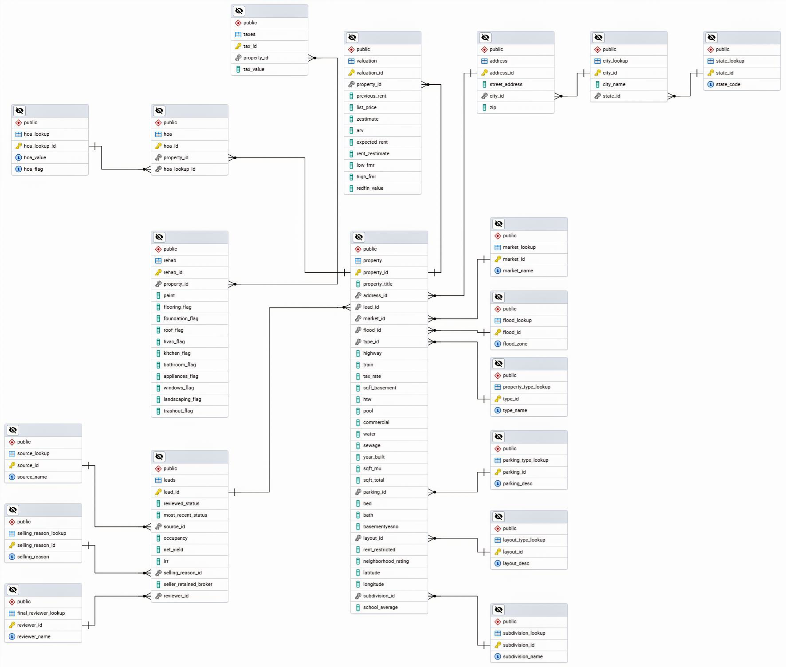
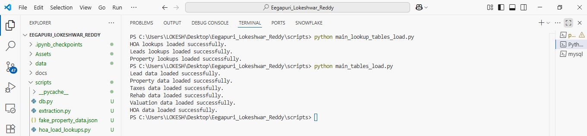

# Data Engineering Assessment

Welcome!  
This exercise evaluates your core **data-engineering** skills:

| Competency | Focus                                                         |
| ---------- | ------------------------------------------------------------- |
| SQL        | relational modelling, normalisation, DDL/DML scripting        |
| Python ETL | data ingestion, cleaning, transformation, & loading (ELT/ETL) |

---

## 0 Prerequisites & Setup

> **Allowed technologies**

- **Python ≥ 3.8** – all ETL / data-processing code
- **MySQL 8** – the target relational database
- **Lightweight helper libraries only** (e.g. `pandas`, `mysql-connector-python`).  
  List every dependency in **`requirements.txt`** and justify anything unusual.
- **No ORMs / auto-migration tools** – write plain SQL by hand.

---

## 1 Clone the skeleton repo

```
git clone https://github.com/100x-Home-LLC/data_engineer_assessment.git
```

✏️ Note: Rename the repo after cloning and add your full name.

**Start the MySQL database in Docker:**

```
docker-compose -f docker-compose.initial.yml up --build -d
```

- Database is available on `localhost:3306`
- Credentials/configuration are in the Docker Compose file
- **Do not change** database name or credentials

For MySQL Docker image reference:
[MySQL Docker Hub](https://hub.docker.com/_/mysql)

---

### Problem

- You are provided with a raw JSON file containing property records is located in data/
- Each row relates to a property. Each row mixes many unrelated attributes (property details, HOA data, rehab estimates, valuations, etc.).
- There are multiple Columns related to this property.
- The database is not normalized and lacks relational structure.
- Use the supplied Field Config.xlsx (in data/) to understand business semantics.

### Task

- **Normalize the data:**

  - Develop a Python ETL script to read, clean, transform, and load data into your normalized MySQL tables.
  - Refer the field config document for the relation of business logic
  - Use primary keys and foreign keys to properly capture relationships

- **Deliverable:**
  - Write necessary python and sql scripts
  - Place your scripts in `sql/` and `scripts/`
  - The scripts should take the initial json to your final, normalized schema when executed
  - Clearly document how to run your script, dependencies, and how it integrates with your database.

**Tech Stack:**

- Python (include a `requirements.txt`)
  Use **MySQL** and SQL for all database work
- You may use any CLI or GUI for development, but the final changes must be submitted as python/ SQL scripts
- **Do not** use ORM migrations—write all SQL by hand

---

## Submission Guidelines

- Edit the section to the bottom of this README with your solutions and instructions for each section at the bottom.
- Place all scripts/code in their respective folders (`sql/`, `scripts/`, etc.)
- Ensure all steps are fully **reproducible** using your documentation
- Create a new private repo and invite the reviewer https://github.com/mantreshjain

---

**Good luck! We look forward to your submission.**

## Solutions and Instructions (Filed by Candidate)

## Property Leads Database

## Overview  
This repository contains the schema and DDL scripts for a normalized property‑leads database. The model captures leads, property details, valuations, rehab estimates, taxes, HOA fees, and various lookup/config tables.

## Schema Diagram  
<div align="center">
  
</div>

### Note: 

- Property-->Leads 1:1 Relationship
- Property-->taxes 1:1 Relationship

## Normalization & Design Decisions  

### 1NF (Atomicity)  
- All **repeating groups** (e.g. multiple valuation scenarios, multiple rehab quotes, multiple HOA entries) have been extracted into their own tables (`valuation`, `rehab`, `hoa`) keyed by a surrogate primary key.  
- Each column in the `property` table holds exactly one atomic value—no JSON arrays or comma‑delimited lists.

### 2NF (Eliminate Partial Dependencies)  
- Every non‑key attribute in a child table depends on the **whole** primary key (which is always a single surrogate key), so there are no partial dependencies.  

### 3NF (Eliminate Transitive Dependencies)  
- All descriptive domains that repeat across rows have been moved into **lookup tables** (e.g. `state_lookup`, `city_lookup`, `market_lookup`, `flood_lookup`, `property_type`, `parking_type`, `layout_type`, `subdivision`, `source_lookup`, `selling_reason_lookup`, `final_reviewer_lookup`).  
- This ensures that changing a label (e.g. correcting “Chicgo” → “Chicago”) happens in exactly one place.  
- The `hoa` table is a pure M:N bridge between `property` and `hoa_lookup`, keeping the 3NF principle intact.

### Assumptions  
- **Taxes**: We assume one current tax record per property. If historical or multi‑year tax data is needed, a composite key (`property_id`, `tax_year`) could be added.  
- **Valuation & Rehab**: Properties may have **multiple records** to represent different vendor quotes or time‑series updates—hence the 1:N relationship.  
- **Leads**: A strict 1:1 relationship exists between `property` and `leads` (each reviewed property has one corresponding lead record).  
- **Flags** (`HTW`, `Pool`, `Commercial`, etc.) are stored as `VARCHAR(10)` (“Yes”/“No”/NULL) to match source data; no boolean conversion was applied.  
- **Typo Handling**: Only basic trimming of whitespace and null/empty checks were done—no fuzzy matching or typo correction, per assignment scope.  
- **Surrogate Keys**: All tables use auto‑increment integer keys for simplicity, rather than natural keys.  


## Tables & Lookups  
| Table                   | Description                                       |
|-------------------------|---------------------------------------------------|
| `source_lookup`         | Valid lead sources (Internal, Auction.com, MLS…)  |
| `selling_reason_lookup` | Why a property is listed (Downsizing, Investor…)  |
| `final_reviewer_lookup` | User who reviewed the lead                        |
| `leads`                 | Marketing leads metadata                          |
| `state_lookup`          | US state codes                                    |
| `city_lookup`           | Cities, linked to `state_lookup`                  |
| `address`               | Street, city, ZIP                                 |
| `market_lookup`         | Market regions (Chicago, Tampa, Dallas…)          |
| `flood_lookup`          | Flood zone designations                           |
| `property_type_lookup`  | SFR, Duplex, Townhouse, etc.                      |
| `parking_type_lookup`   | Garage, Street, Driveway…                         |
| `layout_type_lookup`    | Ranch, Colonial, Split…                           |
| `subdivision_lookup`    | Subdivision names                                 |
| `property`              | Core property metadata                            |
| `hoa_lookup`            | HOA fee + flag combinations                       |
| `hoa`                   | M:N mapping from `property` to HOA entries        |
| `taxes`                 | Single tax record per property                    |
| `valuation`             | Key‐value metrics per property valuation          |
| `rehab`                 | Rehab cost estimates + feature flags              |

## Running & Testing

1. **Connect to MySQL**  
   Ensure you have a running MySQL instance.

2. **Run the DDL script to create all tables**  
   ```bash
   mysql -u db_user -p home_db < DDL_statements.sql
3. **Verify tables exist**
   ```
   SHOW TABLES;
   DESCRIBE property;
   
# ETL Logic & Scripts

## 1. Overview & Design

We use a simple ELT pattern with Python + mysql-connector-python to populate our normalized OLTP schema.

### Extract

- **Extraction Script:** `extraction.py`
  - Reads the source JSON file (`fake_property_data.json`) and parses it into a list of Python dictionaries.

### Load Lookup Tables

- **hoa_load_lookups.py**
  - Iterates over `HOA` lists, de-duplicates (`hoa_value`, `hoa_flag`) pairs, and upserts them into the `hoa_lookup` table.

- **property_load_lookups.py**
  - Extracts unique values for fields like market, flood, property_type, parking, layout, subdivision, state, city, and address.
  - Inserts into respective lookup tables in dependency order: `state` → `city` → `address` → remaining lookup domains.

- **leads_load_lookups.py**
  - Processes fields such as Source, Selling_Reason, and Final_Reviewer, de-duplicates the values, and loads them into their corresponding lookup tables.

### Load Main Tables

- **load_property.py**
  - Maps lookup values to IDs (market, flood, type, etc.)
  - Handles `address_id` resolution.
  - Inserts cleaned records into the `property` table.

- **load_leads.py**
  - Joins lookup IDs and loads lead information into the `leads` table.

- **load_hoa.py**
  - Loads property-to-HOA relationships using existing `hoa_lookup_ids`.

- **load_taxes.py**
  - Extracts and inserts `tax_value` mapped by `property_id`.

- **load_valuation.py**
  - Inserts metrics such as list_price, arv, zestimate, etc., into the `valuation` table.

- **load_rehab.py**
  - Inserts rehab-related flags and estimates (e.g., roof_flag, kitchen_flag, underwriting_rehab) into the `rehab` table.

## 2. Execution Flow

Run your ETL steps in the following order:

```bash
# Step 1: Load lookup tables
python scripts/main_lookup_tables_load.py

# Step 2: Load main tables
python scripts/main_tables_load.py

```
## 3. Requirements

- **Python:** 3.10+
- **MySQL:** 8+

## 3. Requirements

- **Python:** 3.10+
- **MySQL:** 8+

### Python Packages

Install the required packages using:

```bash
pip install -r requirements.txt
```
### Additional Requirements
- A valid and running MySQL instance.
- Database schema must be pre-created using: DDL_statements.sql.

## 4. Sample Execution Screenshot

<div align="center">
  
</div>

## 5. Log Files
Sample logs for each phase of the ETL:

- main_lookup_tables_load.log
- main_tables_load.log

These logs show detailed status of each script, including success messages and any exceptions if encountered.

## 6. Assumptions

- The source JSON (`fake_property_data.json`) may contain empty strings, missing keys, `null`, or `NaN` values.
- During data ingestion and transformation:
  - Any empty (`""`), `NaN`, or `null` values from the JSON are **explicitly converted to SQL `NULL`**.
  - This ensures that the final MySQL tables reflect accurate missing value representation, maintaining data integrity and consistency across the pipeline.
- Lookup tables will **not** insert `NULL` or empty string values; only valid, distinct entries are added.
- In main tables, all unresolved fields (such as foreign keys to lookup tables or numerical values like tax, price, etc.) will be inserted as `NULL` if source data is missing or invalid.

